# Planbrella (Project Portfolio 5, Code Institute)

[The actual website](https://planbrella-ad4018061f52.herokuapp.com/)

The primary goal of this project was to develop an intuitive and user-friendly application that enables users to plan and organize their work efficiently. The app aims to provide a structured approach to task management, ensuring users can easily create, track, and manage their tasks.

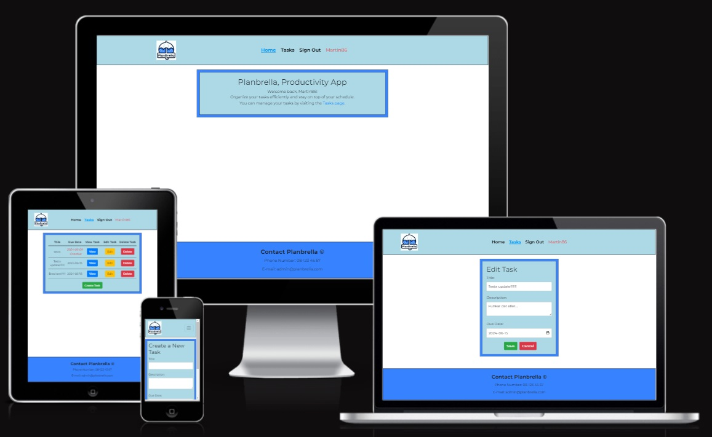

## Content Index

* [Planing Stage](#planing-stage)
    - [Wireframes](#wireframes)
    - [Database Plan](#database-plan)
* [Back-End](#back-end)
    - [Testing](#testing)
    - [Bugs](#bugs)
* [Fron-End](#front-end)
    - [Features](#features)
    - [Reusable Components](#reusable-components)
    - [Design](#design)
    - [Testing](#testing-1)
    - [Bugs](#bugs-1)
* [Overall](#overall)
    - [User Experience (UX)](#user-experience-ux)
    - [Technologies Used](#technologies-used)
    - [Agile](#agile)
    - [Deployment](#deployment)
    - [Credits](#credits)
    - [Acknowledgment](#acknowledgment)

---

# Planing Stage

## Wireframes

Wireframes, used as starting points for the design of the website, were created with Microsoft Paint:

- Desktop Wireframe

- Mobile Wireframe

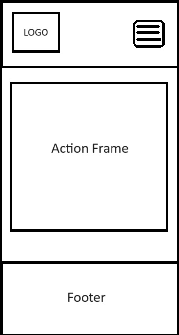

## Database Plan

Entity Relationship Diagrams (ERD) have been used to plan the models in the Back-End.

### User Model

The User Model is included in the Django Rest Framework's dj-rest-auth library. It stores essential information about authenticated users, such as their username and password.

### Profiles Model

| **Name** | **Field Type** | **Validation** |
|-------------|------------|---------------------|
| owner | OneToOneField | on_delete=CASCADE, related_name='profile', required | 
| created_at | DateTimeField | default=now |
| name | CharField | max_length=100, blank=True, null=True |
| description | TextField | blank=True, null=True |

- Signal handling:
    - create_user_profile: Creates a profile for each new user upon user creation.
    - save_user_profile: Saves the profile associated with the user when the user is saved.

### Tasks Model

| **Name** | **Field Type** | **Validation** |
|-------------|------------|---------------------|
| title | CharField | max_length=255 | 
| description | TextField | blank=True, null=True |
| created_at | DateTimeField | auto_now_add=True, editable=False |
| due_date | DateTimeField |  |
| owner | ForeignKey | related_name='owned_tasks', on_delete=models.CASCADE |

- owner:
    - ForeignKey (to settings.AUTH_USER_MODEL)
- is_overdue:
    - Determines if the task is overdue based on the current date and the due date.

### Comments Model

| **Name** | **Field Type** | **Validation** |
|-------------|------------|---------------------|
| task | ForeignKey | related_name='comments', on_delete=models.CASCADE | 
| owner | ForeignKey | on_delete=models.CASCADE |
| text | TextField |  |
| created_at | DateTimeField | auto_now_add=True |
| updated_at | DateTimeField | auto_now=True |

- owner/task:
    - ForeignKey

---

# Back-End

## Testing

### Automated Testing

- Back-End, views (Tasks)

The automated testing is not comprehensive, but it gives an indication of the developer's ability to create automated tests.

### Manual Testing

The manual testing is performed by navigating to the deployed site and appending "/api/" followed by the desired endpoint to view the data. When the project was solely Back-End, all functionalities of the DRF view, including modifying field contents, were tested and worked as expected. After integrating the Front-End and Back-End, access to information is now available exclusively in JSON format. Consequently, changes to the content are now made through the Front-End or the Admin section instead. See the pictures below:

api/profiles

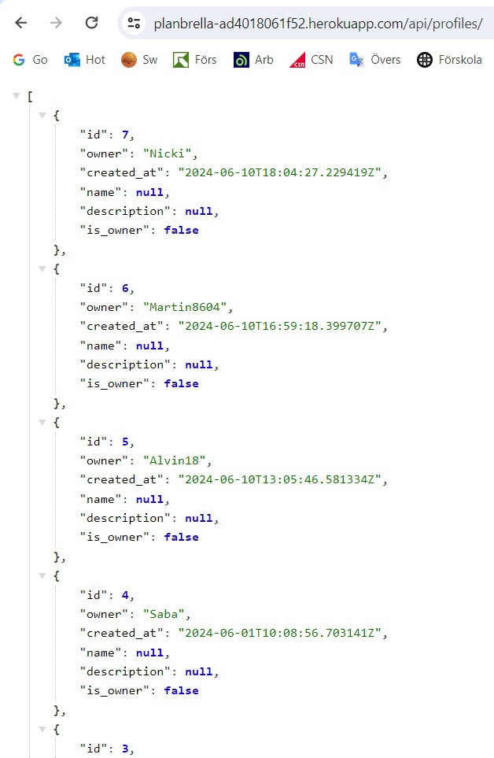

Admin

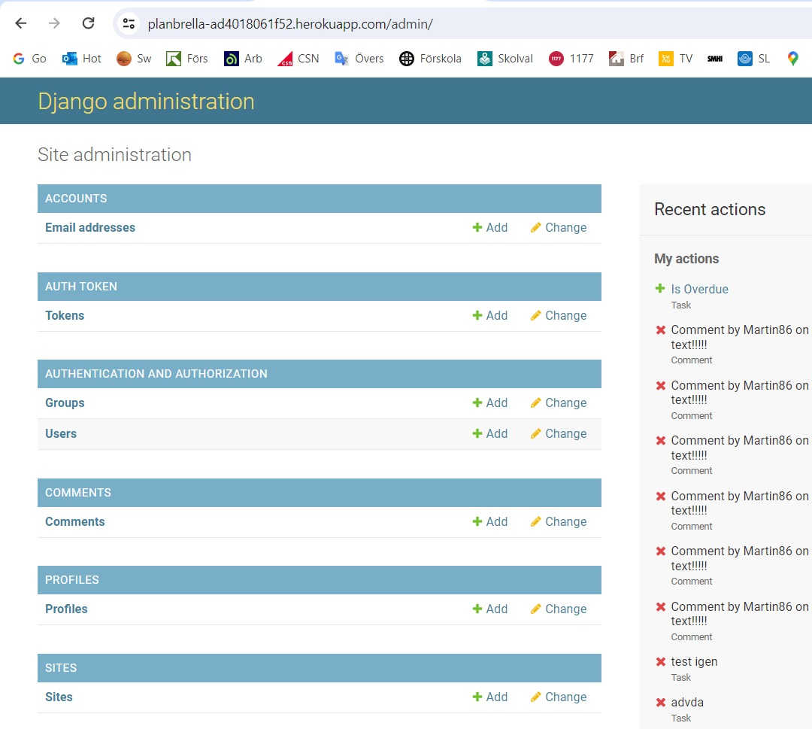

### Python Testing

To test that the Python code meets the PEP8 standard, [CI Python Linter](https://pep8ci.herokuapp.com/) was used.

Python files tested:

- admin
- models
- serializers
- urls
- views
- permissions
- settings
- tests

Only small errors were detected, such as "too few blank lines", "line too long" and "no newline at end of file". All these have now been rectified.

## Bugs

When I deployed to Heroku, there were errors in the code that caused only this text to appear when I opened the app via Heroku:

I tried various ways to fix this, but in the end had to take the help of a tutor. The error turned out to be in my root_route, api_view, which was missing permission_classes. This code solved the problem:

---

# Front-End

## Features

### Home Page

This is the front page where the user ends up first when entering the website:

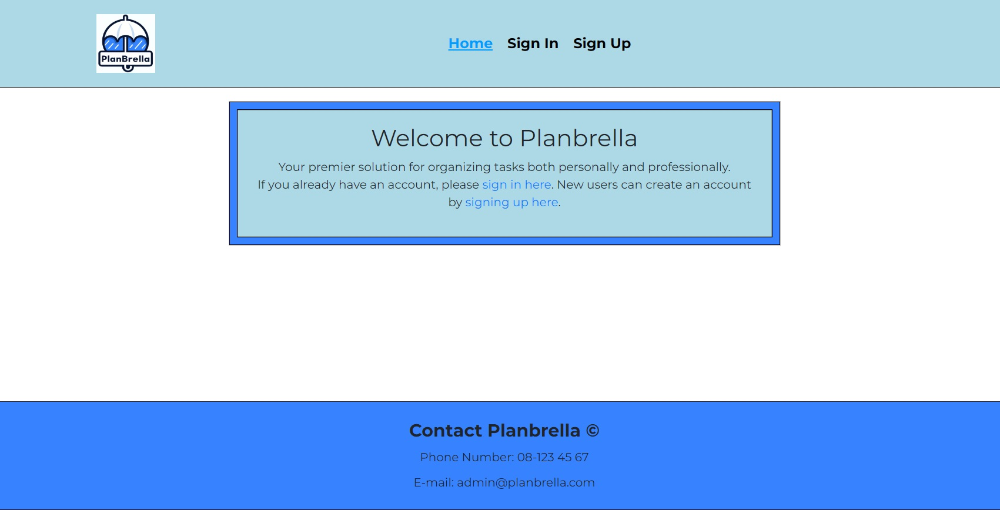

### Sign Up

Here the user can create an account:

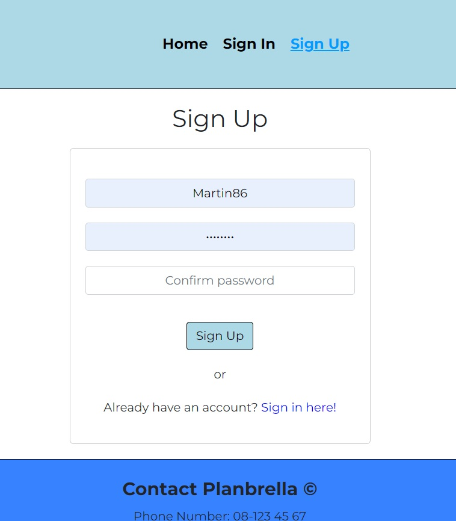

### Sign In

Here the user can sign in:

### Tasks

Here the user can see a list of their tasks, create a new task, navigate to task detail (view), edit a task and delete a task:

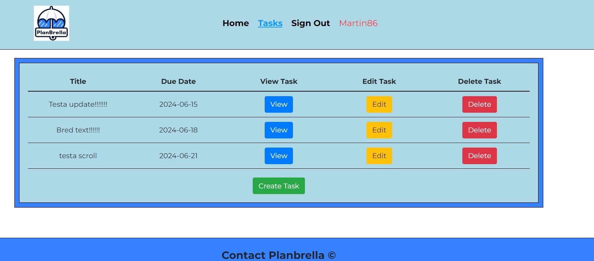

### Task Detail

Here the user can see the details of their created task, edit task, delete task as well as read, write, update and delete comments in the specific task:

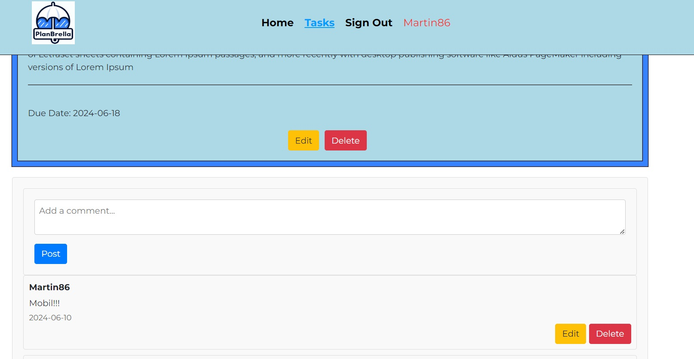

### Task Edit

Task Edit View:

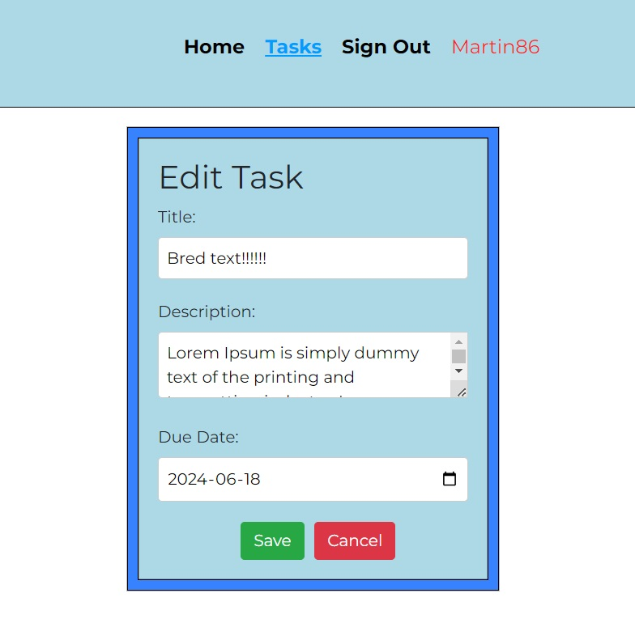

### Future Features

Some of the features I planned for when I started the project have been excluded. This is because much of the time was spent getting other parts to work. For the future, these features could be implemented and make the page more interesting:

- Priority: To organize tasks according to low, medium or high priority.
- Category: To be able to categorize different tasks such as personal or work-related.
- Status: Users can mark a task as Open, In Progress or Done.
- Enables attaching files to tasks.
- Enables assignment and deassignment of task owners.
- Implement task filtering function: The user can filter tasks based on due date, priority, category and status.
- Calendar: Integrate calendar function to sync with tasks.

## Reusable Components

The project utilizes several reusable components across the site. This approach was facilitated by isolating each function into its own file, which then allows for easy importing into other files where the component is needed. While it's always possible to import different files, the advantage of separating your code into smaller, specific files is that it makes the codebase more readable and manageable. By importing only the necessary code, it becomes easier to understand and enhances the functionality of the website.

Below is a list of components that has been separated into their own files to be reused throughout the website. These components, along with others, are imported into various files within the project.

- NavBar.js

    The navigation bar is a critical component used throughout the site. It is imported and displayed on each page, providing users with easy access to different sections of the website.

- CommentCreateForm.js

    This form is used for creating comments and is integrated into multiple places where user interaction is needed, such as on task detail pages.

- CurrentUserContext.js

    The context for managing the current user's state is used across different components to ensure consistent user data and authentication status.

## Design

### Colour Scheme

- [Color Picker](https://imagecolorpicker.com/) was used to ensure the same colour shades were used throughout the website.

- The color theme of the website is blue, with different shades. It gives a clean and pleasant impression and represents the simplicity that the page wants to convey. These two colours have been used:

### Typography

The website uses font-family: 'Montserrat'. A trendy and elegant style with a distinct character.

-   The fonts used were imported from [Google Fonts](https://fonts.google.com/)

### Logo and Favicon

- [ChatGPT](https://chat.openai.com/) was used to create the logo for the webpage

- This page was used to create a favicon for the webpage: [Favicon](https://favicon.io/)

## Testing

### Validator Testing

#### HTML

HTML validation was completed using [W3 Validator](https://validator.w3.org/)

The index.html file has been validated, resulting in 3 errors because the linter does not recognize the %PUBLIC_URL% value. These errors do not impact the project or code functionality. Additionally, there are 8 informational messages that do not affect the code.

HTML Validation

#### CSS

CSS validation was completed using [W3 Validator](https://jigsaw.w3.org/css-validator/)

- All CSS files has been validated and shows no errors.

#### JavaScript (JSX)

To test the code in the Front-End, the Eslint extension has been installed in GitPod. There were some minor errors, but these have been fixed. Issues that remain are as follows:

Eslint

### Lighthouse

The website gives a good response from Lighthouse in Google Chrome on all pages. Here's an example from the Tasks page that matches the other pages' results as well:

Desktop:

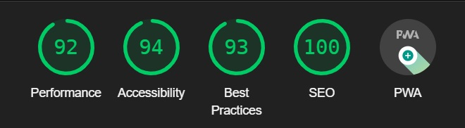

Mobile:

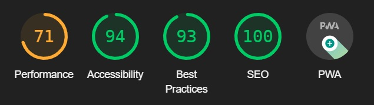

### Manual Testing

#### Unauthenticated User

| **Feature** | **Action** | **Expected result** | **Pass/Fail** |
|-------------|------------|---------------------|-------------------|
| Navbar | Home, Sign In and Sign Up buttons are visible. | Home, Sign In and Sign Up buttons are visible. | :heavy_check_mark: |
| Sign In link | Press the Sign In link. | Enter Sign In page. | :heavy_check_mark: |
| Sign Up link | Press the Sign Up link. | Enter Sign Up page. | :heavy_check_mark: |
| Signing Up | Create Account. | Account is created. | :heavy_check_mark: |
| Signing In | Sign In with created account. | User is signed in. | :heavy_check_mark: |

#### Authenticated User

| **Feature** | **Action** | **Expected result** | **Pass/Fail** |
|-------------|------------|---------------------|-------------------|
| Navbar | Home, Tasks and Sign Out buttons are visible plus Username. | Home, Tasks and Sign Out buttons are visible plus Username. | :heavy_check_mark: |
| Tasks link | Press the Tasks link. | Enter the Tasks page. | :heavy_check_mark: |
| Create Task | Press the Create Task button. | Enter Create Task form. | :heavy_check_mark: |
| Create Task | Create Task. | Task is created. | :heavy_check_mark: |
| View Task | Press the View Task button. | Enter the View Task page. | :heavy_check_mark: |
| Edit Task | Press the Edit Task button. | Enter the Edit Task page. | :heavy_check_mark: |
| Edit Task | Change content and save. | Task is changed and saved. | :heavy_check_mark: |
| Edit Task | Cancel Edit. | Redirected to tasks page. | :heavy_check_mark: |
| Delete Task | Press Delete button. | Task is deleted after confirming. | :heavy_check_mark: |
| Comment | Write comment and press Post button. | Comment is posted. | :heavy_check_mark: |
| Edit Comment | Press Edit button, write and press Save. | Comment is updated. | :heavy_check_mark: |
| Cancel Edit Comment | Press Cancel button in edit mode. | Edit mode is turned off. | :heavy_check_mark: |
| Delete Comment | Press Delete button. | Comment is deleted after confirming. | :heavy_check_mark: |
| Overdue marking | Overdue marking is visible. | Overdue marking is visible. | :heavy_check_mark: |
| Infinite scrolling | Scroll to the bottom of the page. | More comments are loaded, if more exists. | :heavy_check_mark: |
| Sign Out | Press Sihn Out button. | User is signed out. | :heavy_check_mark: |

## Bugs

When pressing the Edit button to update a Task, the date was backdated by one day. To solve this, this code was used:

dueDate

My token handling doesn't seem to be working correctly. I have tried to troubleshoot this in various ways and talked to the tutor. However, it has not been possible to solve it for me. I don't know how to do it. This means that the website stops responding after about 5 minutes and you have to do a refresh. I realize this is a serious problem that might result in a failing grade, but I have not been able to resolve it.

---

# Overall

## User Experience (UX)

### User Stories

All issues are in GitHub within the [Planbrella](https://github.com/users/merin86/projects/7/views/1) project. Acceptance criteria and tasks for the issues can be viewed there.

[Milestones](https://github.com/merin86/planbrella/milestones) were linked to the project.

The Kanban board was instrumental in tracking progress and managing tasks throughout this project. It facilitated planning and the addition of new features, ensuring that all tasks were organized and easily accessible. An additional section was created in the Kanban board with the heading "Wont Have". These features became overwhelming for this project and have therefore been placed under [Future Features](#future-features)

| **EPIC** | **ID #** | **User Story** | **Label** |
|-------------|------------|---------------------|---------------------|
| **User Authentication** | 
|  | 1 | As a Site User I can register an account and log in with existing user details so that I can have a personalized and secure experience | Must Have |
| **Task management** | 
|  | 2 | As a logged in user I can create new tasks within the application so that I can organize and plan my work more easily | Must Have |
|  | 3 | As a logged in user I can view details, edit and delete tasks so that I can effectively manage my daily activities | Must Have |
|  | 5 | As a logged in user I want the system to automatically identify and mark tasks as overdue so that I can immediately see which tasks need immediate attention | Could Have |
 | **Comment Management** | 
|  | 11 | As a logged in user I can post comments on tasks so that I can engage in discussions about task details and progress with other team members | Must Have |

### Flow Diagram

- A non-logged in user can see the home page when the user comes to the page. Here there are only the options to Sign In or Sign Up.

- A logged in user can see the front page, enter the tasks page, create tasks (with CRUD functionality) and write comments (with CRUD functionality) in a specific task. The user can now also Sign Out. The username of the logged in is now also visible in red text to the right of the Sign Out button. If a task is overdue, this is shown by the Due Date becoming red and italicized, and that it says Overdue next to the Due Date.

Flow diagram was created using [Lucidchart](https://lucidchart.com/)

- Flow chart for user:

## Technologies Used

### Programming Languages

-   [HTML5](https://en.wikipedia.org/wiki/HTML5)
-   [CSS3](https://en.wikipedia.org/wiki/Cascading_Style_Sheets)
-   [Python](https://www.python.org/)
-   [JavaScript](https://en.wikipedia.org/wiki/JavaScript)

### Frameworks, Libraries and Programs Used

-   [GitPod](https://www.gitpod.io/)

    The IDE where the site was built.

-   [GitHub](https://github.com/)

    To host and store the data for the site.

-   [Heroku](https://www.heroku.com/)

    Used to deploy the project.

-   [ElephantSQL](https://customer.elephantsql.com/)

    Used to store PostgreSQL database.

-   [Django REST Framework](https://www.django-rest-framework.org/)

    Framework used to create the Back-End for the web page.

-   [React](https://react.dev/)

    Core library for building the user interface.

    - React is a powerful JavaScript library for building fast and interactive user interfaces. Its component-based architecture makes it easy to create reusable UI components, manage state efficiently, and handle complex UIs with ease.

-   [React Bootstrap](https://react-bootstrap.github.io/)

    CSS framework used as a tool to style the web page.

    - React Bootstrap combines the power of Bootstrap with React, providing pre-built components that are fully responsive and customizable. This library helps in creating a consistent and visually appealing user interface quickly.

### Packages

Most important packages:

- django
- djangorestframework
- django-allauth
- dj-rest-auth
- react
- react-router-dom
- react-infinite-scroll-component
- psycopg2
- Gunicorn
- whitenoise
- eslint

## Agile

The project was developed following Agile principles, with the Project Board and Issues features on GitHub playing a central role in its organization.

- [My Project Board](https://github.com/users/merin86/projects/7)

This instruction video was used to help create the Kanban Board: [Agile Guide](https://www.youtube.com/watch?v=U_dMihBgUNY)

## Deployment

### Creating the Workspace

- Create a new repository using the provided template.
- Open the repository in GitPod.

### Setting Up the Backend

- Install Django: pip3 install 'django<4'
- Create Django project: django-admin startproject.
- Create and configure env.py.

### Setting Up the Frontend

- Create frontend directory: mkdir frontend
- Change to frontend directory: cd frontend
- Create React app: npx create-react-app . --template git+https://github.com/Code-Institute-Org/cra-template-moments.git --use-npm
- Remove redundant files: rm -rf .git .gitignore README.md
- Start the app: npm start
- Add local links to env.py for both backend and frontend.
- Configure CORS and proxy settings in settings.py and package.json.

### Creating Heroku App and SQL Database

- Install Gunicorn: pip3 install 'django<4' gunicorn
- Install additional libraries: pip3 install dj_database_url==0.5.0 psycopg2
- Create requirements.txt: pip3 freeze --local > requirements.txt
- Create a New Application in Heroku.
- Set up ElephantSQL and Heroku with necessary configuration variables.

### Deploying the Project

- Install Whitenoise: pip3 install whitenoise==6.4.0
- Update requirements.txt: pip3 freeze > requirements.txt
- Create staticfiles directory: mkdir staticfiles
- Configure Whitenoise in settings.py.
- Update URL patterns in urls.py.
- Create Procfile for deployment.
- Compile static files: python3 manage.py collectstatic
- Build frontend assets: npm run build && mv build ../staticfiles/.
- Add runtime environment: runtime.txt

### Connecting to GitHub Pages

- Set GitHub Pages source to the main branch.
- Deploy.

### Forking and Cloning

- Click the "Fork" button at the top right of the page. This button creates a copy of the repository in your own GitHub account.
- After you make your fork, you can clone it to your local computer to start working with it. You do this by opening the terminal and typing the following command: "git clone https://github.com/your-username/repository-name.git"

## Credits

### Content

- The content of the web page is created by the developer.

### Code

#### Tutorials

- The two walkthroughs "Django REST Framework" and "Moments" from [Code Institute](https://codeinstitute.net/) has been used as pillars to create the structure. Some parts have been copied from these tutorials, such as the logic for "SignUp" and "SignIn".

- [Build a Todo app with Django and React](https://www.youtube.com/watch?v=sBjbty691eI&list=PLXuTq6OsqZjbCSfiLNb2f1FOs8viArjWy) has also been used as a support to create structure for various functions.

#### Websites

- These two websites have been used frequently to create the web page [Create React App](https://create-react-app.dev/) & [React](https://react.dev/)

- Various "Cheat Sheets", provided by CI, have been used in the creation of this web page.

- [Django REST framework](https://www.django-rest-framework.org/) has been used frequently to create the Back-End of the web page.

- [React Bootstrap](https://react-bootstrap.github.io/docs/getting-started/introduction) has been used to style the web page and apply the correct codes for this.

- This previous PP5 project has been used as a source of inspiration and also as a tool, using DevTools, for various codes: [ProPlanX](https://project-5-proplanx-536622b745e3.herokuapp.com/)

- The following web page has been used as a learning tool and source of inspiration to create own codes for the website: [W3Schools](https://www.w3schools.com/)

- This README.md has been used as a template to create this README: [pro5 - README.md](https://github.com/gStarhigh/pro5/blob/main/README.md)

- With the help of [MDN Web Docs](https://developer.mozilla.org/en-US/), the automated tests for the project were created.

- These two web pages were used when installing and configuring django-allauth and dj-rest-auth: [allauth](https://docs.allauth.org/en/latest/installation/quickstart.html) & [rest-auth](https://dj-rest-auth.readthedocs.io/en/latest/installation.html)

#### Other References

- This page was used to generate a secret code: [Djecrety](https://djecrety.ir/)

## Acknowledgment

- I want to thank the tutor (Roman) who helped me fix the "bug" that caused problems when I tried to open my APIView via Heroku.

- I also want to thank the tutor (Thomas) who helped me when I was deploying the unified application to Heroku.